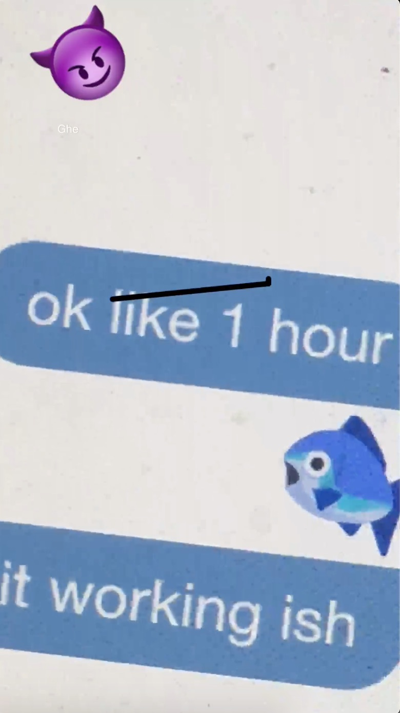

# Pinata

Pinata is an anonymous video social network for college-campuses. Included in this repo is only the vine-like recorder that I built. I was really just starting to learn how to create a video editor and I didn't anticipate how large the view controllers would grow to be (1 screen != 1 view controller. Logic should be dependency injected with seperate managers and corresponding protocols). So a lot of the code here needs to be rewritten a lot more cleanly and also updated for iOS 13 which broke some things. I will slowly work on doing over time when I get a chance. 

It supports clips, photos, importing media, deleting segments, and customizable add-ons like text, drawings, and stickers. 

Here's a demo gif

Here's a meme of my doggo

A few other samples in case the gif doesn't load

